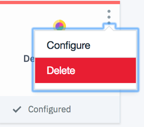

---

copyright:
  years: 2018
lastupdated: "2018-8-2"

---

{:shortdesc: .shortdesc}
{:new_window: target="_blank"}
{:codeblock: .codeblock}
{:pre: .pre}
{:screen: .screen}
{:tip: .tip}
{:download: .download}

# Managing personal data in DevOps Insights
{: insights_personal_data}

You can delete personal data that is collected and stored in {{site.data.keyword.DRA_full}}.
{: shortdesc}

Data that is stored in {{site.data.keyword.DRA_short}} is indexed by toolchain ID. When you delete a toolchain, all of the data that is related to repos that was collected as part of the toolchain is deleted.

IBM does not manage data in the {{site.data.keyword.DRA_short}} service. Before you leave the {{site.data.keyword.DRA_short}} service, you must delete your own data. To delete your data, delete the {{site.data.keyword.DRA_short}} tool integration from your toolchain. If the {{site.data.keyword.DRA_short}} tool integration is not added again to the toolchain within seven days, the data is deleted.
{: tip}

## Deleting data from {{site.data.keyword.DRA_short}}
{: #insights_delete_data}

The following table lists the scenarios for deleting data from {{site.data.keyword.DRA_short}} and describes how they impact each of the {{site.data.keyword.DRA_short}} categories.

|  | Developer and Team Insights | Deployment Risk | Security Insights |
|---------|-------------|-------------|-------------|
| [Deleting a repo ](/docs/services/ContinuousDelivery/cd_personal_data.html#managing_grit_data){: new_window} |	All data that is related to the repo is deleted.  | N/A | N/A |
| [Deleting a {{site.data.keyword.DRA_short}} tool integration ](/docs/services/ContinuousDelivery/cd_personal_data.html#managing_toolchains){: new_window} |	All data that is related to the repo is deleted.  | All data that is associated with the toolchain that the tool integration is part of is deleted. | All data that is related to repos that are associated with the toolchain that the tool integration is part of is deleted.  |
| [Deleting a toolchain ](/docs/services/ContinuousDelivery/cd_personal_data.html#managing_toolchains){: new_window} | All data that is related to repos that are associated with the toolchain is deleted. | All data that is associated with the toolchain is deleted.  | All data that is associated with the toolchain is deleted. |
| [Deleting a pipeline ](/docs/services/ContinuousDelivery/cd_personal_data.html#managing_pipeline_data){: new_window} | N/A | N/A | N/A |
{:caption="Table 1. Data deletion scenarios" caption-side="top"}

## Deleting a {{site.data.keyword.DRA_short}} tool integration
{: #insights_delete_integration}

If you delete a tool integration from your toolchain, the deletion cannot be undone.

1. On the DevOps dashboard, on the **Toolchains** page, click a toolchain to open its Overview page. Alternatively, on the app's Overview page, on the Continuous delivery card, click **View Toolchain**, and then click **Overview**.
1. On the card for the {{site.data.keyword.DRA_short}} tool integration that you want to delete, click the menu to access the configuration options.
1. To delete the tool integration from your toolchain, click **Delete**.

  

1. Confirm by clicking **Delete**. 
