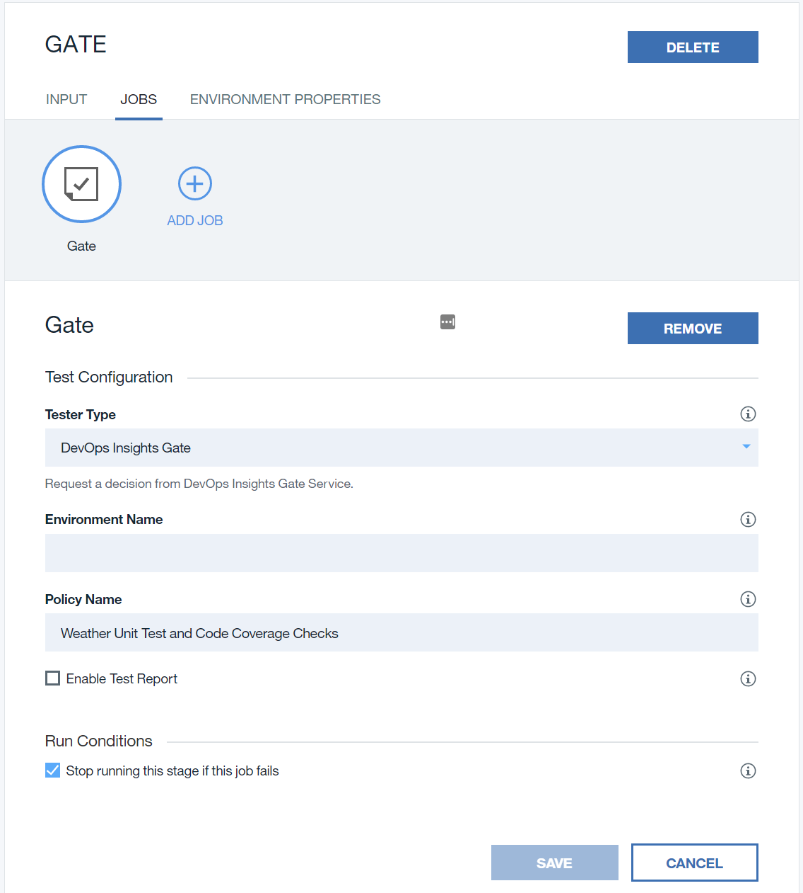

---

copyright:
  years: 2016, 2018
lastupdated: "2017-10-25"

---

{:new_window: target="_blank"}
{:shortdesc: .shortdesc}
{:screen: .screen}
{:codeblock: .codeblock}
{:pre: .pre}

# Deployment Risk 分析と継続的デリバリーの統合

{{site.data.keyword.DRA_short}} は、ユーザーから公開されたテスト・データに基づいてデプロイメントのリスクを追跡します。このデータには、単体テスト、コード・カバレッジ、機能検証テスト、SonarQube データ、または IBM Application Security on Cloud のスキャン・データを含めることができます。このようなデータを公開した後、リスク・ポリシーを満たさないビルドを停止するためのゲートをパイプラインに追加できます。

{{site.data.keyword.DRA_short}} の Deployment Risk 分析の概説については、[Deployment Risk について](./about_risk.html)を参照してください。

継続的デリバリーのパイプラインについて詳しくは、[公式のドキュメンテーション](../ContinuousDelivery/pipeline_working.html)を参照してください。

## 概説
{: #integrate_pipeline}

{{site.data.keyword.DRA_short}} でデプロイメントのリスクを分析するには、パイプラインから取得した以下の情報が必要です。

* ビルド・レコード
* デプロイメント・レコード
* テスト結果

テスト結果では、サポート対象となる以下のいずれかの形式でデータを提供する必要があります。

| テスト・タイプ                    | サポートされる形式                                               |
|------------------------------|-----------------------------------------------------------------|
| 機能検証テスト | Mocha、xUnit                                                    |
| 単体テスト                    | Mocha、xUnit、Karma/Mocha                                       |
| コード・カバレッジ                | Istanbul、Blanket.js、Cobertura、lcov                                           |
| 静的アプリ・スキャン              | IBM Application Security on Cloud で提供される静的アプリ・スキャン  |
| 動的アプリ・スキャン             | IBM Application Security on Cloud で提供される動的アプリ・スキャン |
| SonarQube                    | SonarQube スキャンで提供されるスキャン・データ                           |

パイプラインで定義する環境変数は、これらのレコードを公開するためのコンテキストを提供します。 これらの環境変数は、ご使用のジョブのスクリプト内の `export` コマンドを使用して定義できます。 また、各パイプライン・ステージの「環境プロパティー」メニューでも設定できます。

環境変数:

| 環境変数  | 目的 | 必要なジョブ |
|-----------------------|-------- |-------------|
| `LOGICAL_APP_NAME`    | ダッシュボード上のアプリの名前。 | {{site.data.keyword.DRA_short}} のリスク・ポリシーのビルド、テスト、デプロイ、実施を行うすべてのジョブ。 |
| `BUILD_PREFIX`  | ステージのビルドに接頭部として追加されるテキスト。 このテキストは、ダッシュボードにも表示されます。 | {{site.data.keyword.DRA_short}} のリスク・ポリシーのビルド、テスト、デプロイ、実施を行うすべてのジョブ。 |
| `LOGICAL_ENV_NAME`  | アプリケーションが実行される環境。 | テスト・ジョブとデプロイ・ジョブ。 |

以下のように、これらの変数を矛盾のないように使用してください。

* 特定のアプリケーションについては、すべてのジョブまたはステージで同じ `LOGICAL_APP_NAME` を使用してください。 
* 特定のアプリおよびビルド・タイプについては、同じ `BUILD_PREFIX` 値を使用してください。例えば、マスター・ブランチのビルドの場合は、`BUILD_PREFIX` を `"master"` にします。 
* 対応するデプロイ・ジョブとテスト・ジョブには同じ `LOGICAL_ENVIRONMENT_NAME` 値を使用します。デプロイ・ジョブで `"PRODUCTION"` という `LOGICAL_ENVIRONMENT_NAME` 値を使用する場合は、同じ環境で実行されたテストの結果を公開するときにもその同じ値を使用します。

## ビルド・ジョブの環境変数

ステージ内の最後のビルド・ジョブについて、アプリケーション名とビルド接頭部の環境変数を設定します。 サンプル・スクリプトには以下のコマンドが含まれます。

```
export LOGICAL_APP_NAME="SampleApp"
export BUILD_PREFIX="master"
```

このビルド・ジョブが完了すると、パイプラインが {{site.data.keyword.DRA_short}} に、SampleApp ビルドが完了したことを示すメッセージを公開します。

## デプロイ・ジョブの環境変数

ステージ内の最後のデプロイメント・ジョブについて、アプリケーション名、ビルド接頭部、環境名を設定します。 サンプル・スクリプトには以下のコマンドが含まれます。

```
export LOGICAL_APP_NAME="SampleApp"
export BUILD_PREFIX="master"
export LOGICAL_ENV_NAME="Production"
```

デプロイメント・ジョブが終了すると、パイプラインが {{site.data.keyword.DRA_short}} に、指定されたビルドとアプリが環境にデプロイされたことを示すメッセージを公開します。

## テスト・ジョブの環境変数

テスト結果を生成するすべてのジョブについて、アプリケーション名とビルド接頭部を設定します。

ジョブによって機能検証テスト (FVT) の結果が生成される場合は、テストが実行されるすべての場所に論理環境名を設定する必要もあります。

サンプル・スクリプトには以下のコマンドが含まれます。

```
export LOGICAL_APP_NAME="SampleApp"
export BUILD_PREFIX="master"

# The LOGICAL_ENV_NAME variable is only needed when publishing FVT results.
export LOGICAL_ENV_NAME="Production"
```

## テスト結果の公開
{: #configure_pipeline_jobs}

{{site.data.keyword.DRA_short}} は、ジョブのテスト結果を使用してレポートを生成し、リスク・ポリシーを実施します。

パイプラインでは、テストを実行するために任意のジョブ・タイプを使用できます。 そのテストを実行した後、その結果を {{site.data.keyword.DRA_short}} にアップロードすることができます。 結果をアップロードするには、ジョブのシェル・スクリプトで CLI を呼び出します。 

以下のタイプのテスト結果を CLI からアップロードできます。

* 単体テスト
* コード・カバレッジ
* 機能検証テスト
* SonarQube 結果
* IBM Application Security on Cloud からの静的アプリ・スキャンと動的アプリ・スキャンの結果 

テストを実行してから結果を {{site.data.keyword.DRA_short}} にアップロードするためのサンプル・スクリプトを以下に示します。 

```
# Run tests and generate a test results file here.
...

# Then, publish results to DevOps Insights
export PATH=/opt/IBM/node-v4.2/bin:$PATH
npm install -g grunt-idra3
idra --publishtestresult --filelocation=fvttest.json --type=fvt
```

この例で、`--publishtestresult` フラグを指定して実行される `idra` コマンドは、スクリプトが結果をアップロードすることを示しています。`--filelocation` フラグは、ジョブのルート・ディレクトリーを基準とするテスト結果ファイルの相対位置を示しています。`--type` フラグは、実行するテストのタイプを示しています。

`idra` コマンドでは以下の `type` 値がサポートされます。 

| タイプ| 説明|
|------|-------------|
| `unittest` | 単体テストの結果 | 
| `fvt` | 機能検証テストの結果 |
| `code` | コード・カバレッジの結果 | 
| `sonarqube` | SonarQube スキャンの結果 | 
| `staticsecurityscan` | IBM Application Security on Cloud の静的セキュリティー・スキャンの結果 |
| `dynamicsecurityscan` | IBM Application Security on Cloud の動的セキュリティー・スキャンの結果 |

`idra` コマンドについて詳しくは、[npm の grunt-idra3 パッケージのページ](https://www.npmjs.com/package/grunt-idra3)を参照してください。 

## ゲートの定義
{: #configure_pipeline_gates}

{{site.data.keyword.DRA_short}} ゲートは、定義されたポリシーにテスト結果が準拠しているかどうかを検査します。 ポリシーに準拠していない場合、デフォルトで {{site.data.keyword.DRA_short}} ゲートは失敗します。 また、アドバイザリー・ロールで機能するようにゲートを構成して、失敗の後もパイプラインが先へ進むことを許可することができます。

Deployment Risk ダッシュボードは、ステージング・デプロイメント・ジョブの後にゲートが存在することに依存しています。 ダッシュボードを使用する場合は、ステージング環境へのデプロイの後、実稼働環境へのデプロイの前にゲートを配置してください。

通常、ゲートは、パイプラインの中でビルド・プロモーションの前に配置されます。 この場所は、ビルドの品質をポリシーに照らして検査して、それが別の環境に安全にプロモートできるものであることを確認するのに理想的な場所です。 しかし、ゲートは、特定の基準の検査を必要とする、パイプライン内の任意の場所に配置することが可能です。 ステージング環境へのデプロイの前に配置されるゲートでも、ポリシーが適用されますが、それらは Deployment Risk ダッシュボードに表示されません。

1. ステージで**「ステージ構成 (Stage Configuration)」**アイコン  をクリックし、**「ステージの構成 (Configure Stage)」**をクリックします。
2. **「ジョブの追加 (Add Job)」**をクリックします。 ジョブ・タイプとして**「テスト」**を選択します。
3. テスター・タイプとして**「{{site.data.keyword.DRA_short}} ゲート ({{site.data.keyword.DRA_short}} Gate)」**を選択します。
4. 環境名を指定します。 この値が、[環境プロパティー](#toolchain_pipeline_props)で定義したものと一致することを確認してください。
5. このゲートにおいてチェックするポリシー名を入力します。

 この名前は、定義したポリシー名のいずれかと完全に一致していなければなりません。 ご使用のツールチェーンと同じ {{site.data.keyword.Bluemix_notm}} 組織で定義されたポリシーのみを指定できます。

6. オプション: ゲートを推奨モードで機能させるには、**「このジョブが失敗した場合、このステージの実行を停止する (Stop running this stage if this job fails)」**チェック・ボックスをクリアします。 推奨モードでは、{{site.data.keyword.DRA_short}} は同じポリシー分析をゲートで実行し、レポートを生成しますが、失敗となった場合でもパイプラインは停止されません。
7. **「保存」**をクリックして、パイプラインに戻ります。
8. 上記のステップを繰り返して、すべての {{site.data.keyword.DRA_short}} ポリシーについてゲートをセットアップします。


*図 2. DevOps Insights ゲート*

パイプラインを構成した後、{{site.data.keyword.DRA_short}} の使用を開始します。 
